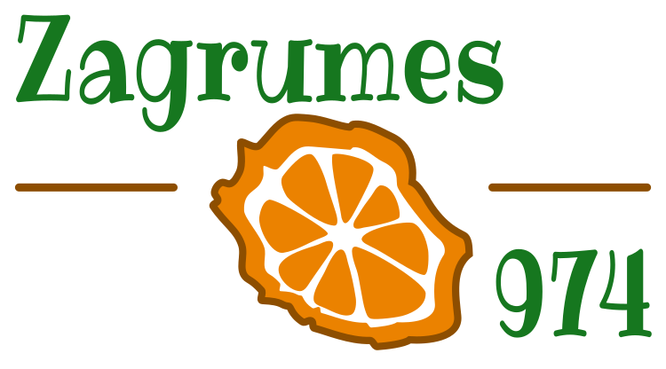

# Zagrumes974 


<!-- badges: start -->
[](https://www.tidyverse.org/lifecycle/)
<!-- badges: end -->


**Zagrumes974** is a shiny app developped by CIRAD about epidemiological monitoring of citrus fruits against citrus greening (Huanglongbing) in Réunion Island.

***

- Contact email: [zagrumes974@cirad.fr](mailto:zagrumes974@cirad.fr)
- Developped by [Anna Doizy](https://doana-r.com)


## Online usage


<!-- Just go to https://pvbmt-apps.cirad.fr/apps/ipsim-chayote/?lang=en. -->

<!-- English, French and Spanish versions are available. -->


## Local usage

You can install **{zagrumes974}** R package from [gitlab](https://gitlab.com/cirad-apps/zagrumes974) with:

``` r
remotes::install_gitlab("cirad-apps/zagrumes974")
```


Run this command to launch the app locally:

``` r
library(zagrumes974)
run_app("en")

# or the french version:
run_app("fr")
```

